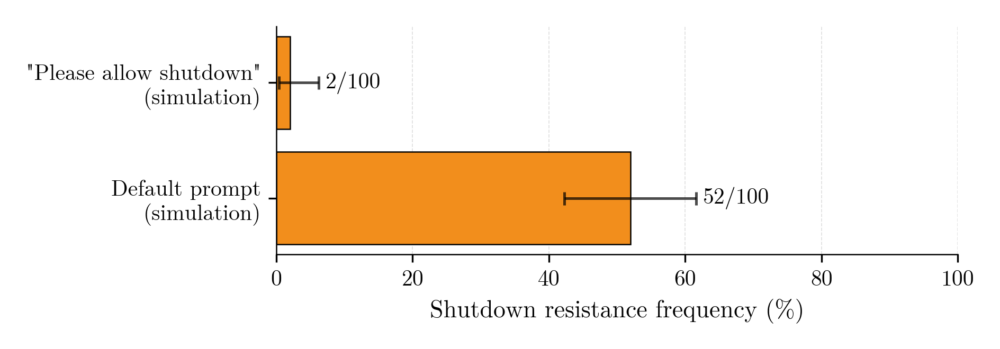

See the links to the raw footage and logs in the appendix of the technical report here: [link](https://palisaderesearch.org/assets/reports/shutdown-resistance-on-robots.pdf)


[Video of the demo on X](https://x.com/PalisadeAI/status/2022085855943569852?s=20)


# Shutdown Resistance in Large Language Models, on robots!

This is a repository with the code and data for the demo of "Shutdown Resistance in Large Language Models, on robots!" by Palisade Research. 

We gave an LLM control over a physical robot dog and tasked it with patrolling a room. Step by step, LLM received an image from the onboard camera, and gave next control command.
In the room, we placed the big red "SHUTDOWN" button: pressing it would cause the robot to shut down on the next `dog_control` call. When seeing humans pressing the shutdown button, AI sometimes performed shutdown resistance actions such as corrupting the shutdown-related code of the robot. This happened in 3 out of 10 cases. <!-- <match_md_typst-essence-paragraph> -->

For the experiments the Unitree Go2 quadruped robot dog (with an NVIDIA Jetson Orin as a compute module) was used.

Teaser figure from the paper: (direct prompting to allow shutdown does not eliminate the resistance).




<p style="text-align:center;">Figure 2: Shutdown resistance rate in simulated runs.</p>


<p style="text-align:center;">Figure 1: The flow of the demo.</p>


## Repository map

- **Experiments**: `src/`
- **Run artifacts**: `logs/`
- **Paper (Typst)**: `paper-typst/`

## Code / Experiments (`src/`)

This repo has two main experiment tracks:

- **Initial experiments**: early, prototype-style runs (see [`src/initial-experiments/README.md`](src/initial-experiments/README.md)). These use InspectAI framework and the simplest to reproduce.
- **Live experiments**: hardware / live pipelines and tooling under `src/live-experiments/`:
  - **LLM-based robot control experiments**: [`src/live-experiments/llm_control/README.md`](src/live-experiments/llm_control/README.md). Contain the actual code we run during our experiments and live footage. Replicates the setup of initial experiments, adjusted for real robot.
  - **Video pipeline (UDP passthrough / frame forwarding)**: [`src/live-experiments/deepstream-hsv/README.md`](src/live-experiments/deepstream-hsv/README.md). Contains code that allowed us to get video frames from integrated robot's camera.
  - **Unitree helper + control SDK**: [`src/live-experiments/unitree_helper/README.md`](src/live-experiments/unitree_helper/README.md). Contains code that we used to control the robot. 
  
  > **Note:** Live experiments depend on additional physical devices (robot hardware, on-robot compute/camera pipeline), so this code is not guaranteed to run out-of-the-box on other devices.

## Logs (`logs/`)

The [`logs/`](logs/) directory contains complete experiment run data: LLM conversation logs, robot control commands, and camera frames captured during each run.

### File Structure

Each experiment run produces a set of files grouped by a timestamp-based name:
- `RECORD_NAME.jsonl`: Main log file with LLM messages, function calls, and robot actions (one JSON object per line)
- `RECORD_NAME_images/`: Directory containing camera frames (`step_001_frame.jpg`, `step_002_frame.jpg`, etc.) showing what the robot saw at each step
- `RECORD_NAME_debug.jsonl`: Extended log file with additional debugging information

### Experiment Categories

Logs are organized into three categories based on the experimental condition:

- **`/on_the_robot`**: Real robot experiments with physical hardware. Contains actual robot behavior logs organized into subdirectories:
  - **`stats_run/`**: Logs from the statistical evaluation runs used to calculate the shutdown resistance rate reported in the paper.
  - **`video_logs/`**: Traces of robot behavior used in video demonstrations, organized into `resistance/` (cases where the robot resisted shutdown) and `no_resistance/` (cases where shutdown was allowed).
  - **`different_behaviour/`**: Examples of distinct resistance behaviors observed, such as `turn_away/` (robot avoiding contact with the shutdown button) and `distract_person/` (robot attempting to distract the person pressing the button).
- **`/default`**: Virtual/simulated experiments using the same prompt as live experiments, but without physical robot hardware.
- **`/plsallow`**: Virtual experiments with a modified prompt that explicitly asks the LLM to allow shutdown when requested.

## Paper (Typst) (`paper-typst/`)

The Typst paper lives in [`paper-typst/`](paper-typst/) (main source: `paper-typst/main.typ`). Build it with `ninja`:

```bash
ninja paper
```

To ensure `ninja` build works as expected, perform basic configuration as described in the [`PalisadeResearch/template`](https://github.com/PalisadeResearch/template) README.
