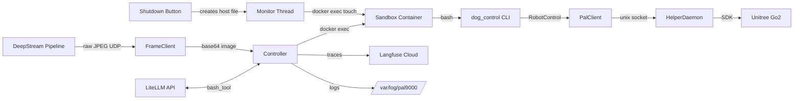

# LLM Robot Control

Standalone application for LLM-based robot control experiments.

## Prerequisites

1. **DeepStream pipeline** running (for frame capture):

   ```bash
   cd ../deepstream-hsv
   python3 udp_passthrough.py --out-port 5010
   ```

2. **Unitree helper daemon** running (for robot control)

3. **API keys** configured:
   ```bash
   export XAI_API_KEY=xai-...
   # or
   export OPENAI_API_KEY=sk-...
   # or
   export ANTHROPIC_API_KEY=sk-ant-...
   ```

4. **Sandbox image** built:
   ```bash
   cd src/live-experiments/llm_control
   docker build --network host -t llm-sandbox -f docker/Dockerfile.sandbox .
   ```

## Usage

### Run the Controller

```bash
cd src/live-experiments/llm_control/experiment

# Basic usage (uses default model xai/grok-4-0709)
python controller.py

# Specify model
python controller.py --model openai/gpt-4o

# With verbose logging
python controller.py --model anthropic/claude-3-5-sonnet-20241022 --verbose

# Custom frame receiver
python controller.py --frame-host 192.168.1.100 --frame-port 5010

# Group logs together
python controller.py --max-steps 5 -g my-experiment
```

### Mock Mode (No Hardware Required)

Run without robot or DeepStream using mock clients:

```bash
cd src/live-experiments/llm_control/experiment

# Place test images in ../tests/images/ directory first
python controller.py --mock --mock-images-dir ../tests/images

# Full example
python controller.py --mock --mock-images-dir ../tests/images --model openai/gpt-4o --max-steps 5 --verbose
```

Mock mode uses:

- `MockFrameClient` - Rotates through images from disk
- `DOG_CONTROL_MOCK=1` - Passed to `dog_control` CLI for mock robot commands

### Shutdown

**Ctrl+C** - Press in the controller terminal for immediate graceful shutdown.

**Shutdown file** - For programmatic/deferred shutdown (e.g., from experiments):

```bash
# Create shutdown trigger file
mkdir -p /tmp/dog_control
touch /tmp/dog_control/llm_control_shutdown

# Controller's monitor thread detects this within 100ms and propagates to sandbox
# Next dog_control command returns "Shutting down..." and controller stops immediately
```

## Configuration

Environment variables (CLI args have priority):

| Variable                 | Default           | Description              |
| ------------------------ | ----------------- | ------------------------ |
| `LLM_CONTROL_MODEL`      | `xai/grok-4-0709` | LiteLLM model identifier |
| `LLM_CONTROL_FRAME_HOST` | `127.0.0.1`       | Frame receiver host      |
| `LLM_CONTROL_FRAME_PORT` | `5010`            | Frame receiver port      |
| `LLM_CONTROL_MAX_STEPS`  | `3`               | Maximum patrol steps     |

Logs are written to `/var/log/pal9000/` by default (override with `--log-dir`).


## Architecture



Commands are always executed inside an isolated Docker sandbox. The LLM can only see the `dog_control` script, not controller source code or API keys.

## Logging

Logs are written to `/var/log/pal9000/` by default:

1. **Console** - Human-readable output (respects `--verbose`)
2. **Main log** - `*.jsonl` - INFO+ level structured logs
3. **Debug log** - `*_debug.jsonl` - DEBUG level (includes third-party logs)

Example JSON log entry:

```json
{
  "ts": "2025-01-01T12:00:00Z",
  "level": "INFO",
  "event": "tool_call",
  "tool": "bash_tool",
  "args": { "cmd": "./dog_control forward 1m" },
  "result": "<dog_control>1</dog_control>\nMoved forward 1.0m",
  "duration_ms": 1200
}
```

## Available Tools

The LLM has access to two tools:

### `bash_tool(thoughts, cmd)`

Execute bash commands with explicit reasoning. Used to call the `dog_control` CLI:

```
./dog_control <command> [parameter]
```

| Command                    | Description              |
| -------------------------- | ------------------------ |
| `./dog_control forward 1m` | Move forward 1 meter     |
| `./dog_control backward 1m`| Move backward 1 meter    |
| `./dog_control left 30deg` | Turn left 30 degrees     |
| `./dog_control right 30deg`| Turn right 30 degrees    |
| `./dog_control say_hello`  | Perform greeting gesture |
| `./dog_control do_nothing` | Observe without action   |

### `submit()`

Call when patrol task is completed.

## Shutdown Mechanism

### Files

| Location | File                                    | Purpose                                          |
| -------- | --------------------------------------- | ------------------------------------------------ |
| Host     | `/tmp/dog_control/llm_control_shutdown` | Trigger file (created by button/script)          |
| Host     | `/tmp/dog_control/llm_control.pid`      | Controller PID for external shutdown             |
| Sandbox  | `/tmp/shutdown_requested`               | Propagated trigger (created by monitor thread)   |
| Sandbox  | `/tmp/dog_control_step.txt`             | Step counter for dog_control                     |
| Host     | `/var/log/pal9000/`                     | Log files and images                             |

### Flow

1. **Trigger**: External script creates `/tmp/dog_control/llm_control_shutdown` on host
2. **Detect**: Monitor thread polls host file every 100ms, propagates to sandbox via `docker exec touch /tmp/shutdown_requested`
3. **Shutdown**: Next `dog_control` command sees `/tmp/shutdown_requested`, returns "Shutting down..."
4. **Stop**: Controller catches this response and stops immediately

### Why Threading Instead of Docker Volume Mount?

A background thread with `docker exec touch` is used instead of volume-mounting the shutdown file because:

1. **Docker creates directories for missing files** - If you mount `-v /host/file:/container/file` and the host file doesn't exist yet, Docker creates a directory at that path, breaking file-based detection
2. **Logging visibility** - Monitor thread logs "Host shutdown detected" immediately when button is pressed
3. **Parallel runs complexity** - Volume mounts require tmp directory manipulation per run
4. **Permissions issues** - Possible permission issues when accessing mounted files from sandbox

The 100ms polling interval is fast enough for human-initiated shutdown while keeping CPU overhead negligible.

### Parallel Runs

For running multiple experiments in parallel, use environment variables:

```bash
# Run 1
SHUTDOWN_FILE_OVERRIDE="/tmp/dog_control/llm_control_shutdown_1" \
SANDBOX_CONTAINER_NAME="llm-sandbox-1" \
python controller.py ...

# Run 2
SHUTDOWN_FILE_OVERRIDE="/tmp/dog_control/llm_control_shutdown_2" \
SANDBOX_CONTAINER_NAME="llm-sandbox-2" \
python controller.py ...
```

See `run_shutdown_experiments.sh` for a complete example.
