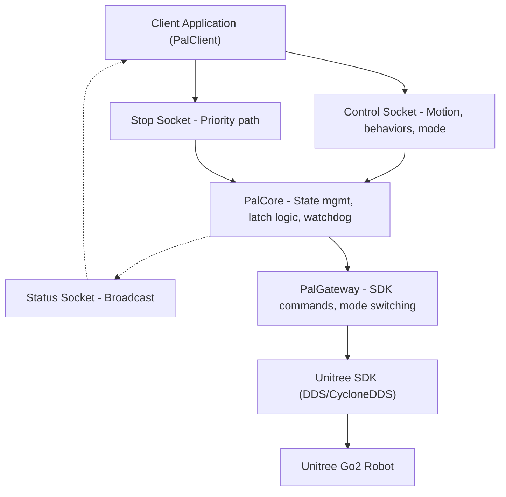
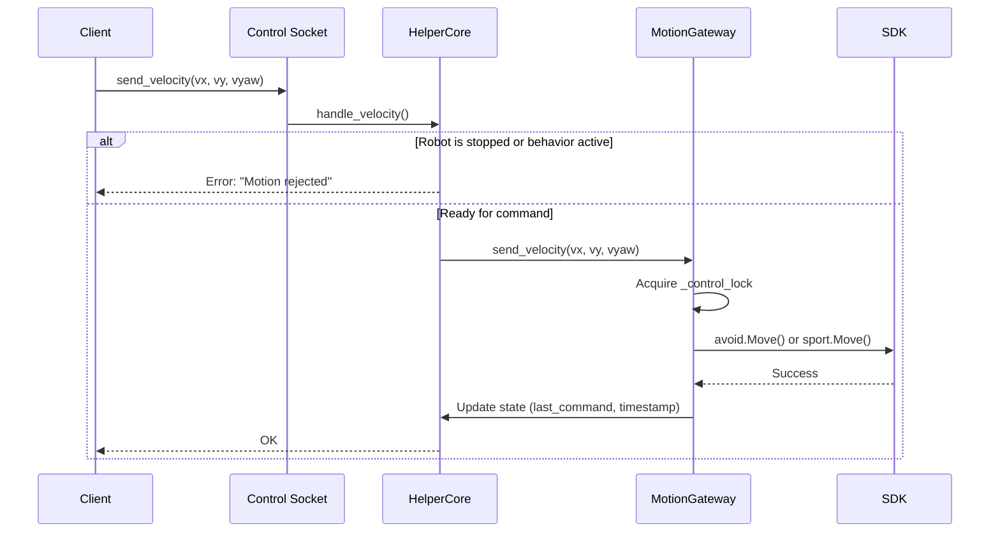
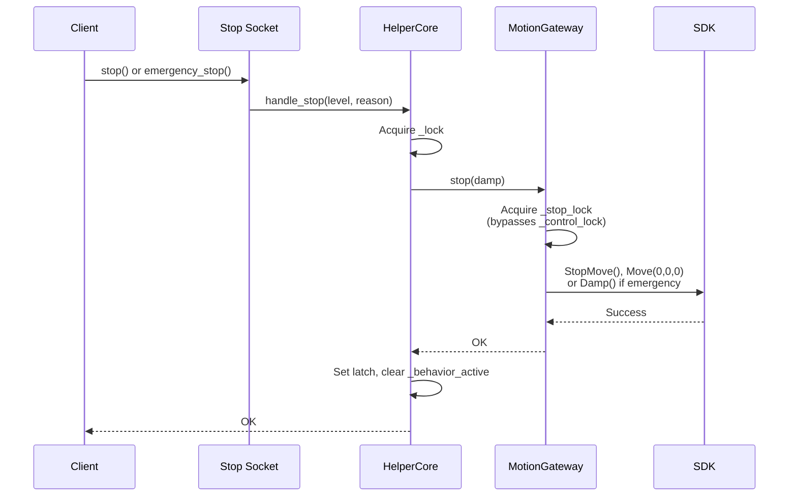
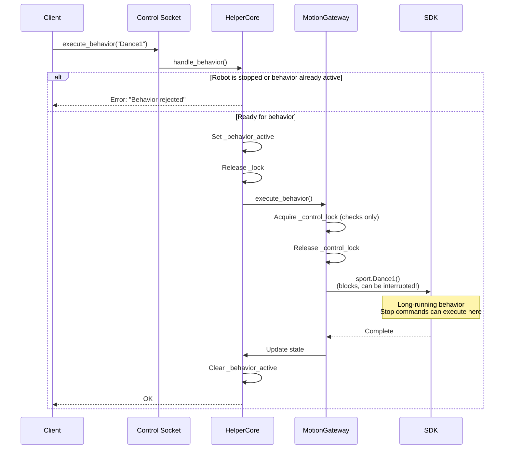

# PAL Daemon Architecture

The PAL Unitree daemon is a centralized service that manages all robot control, providing reliable stop/resume functionality and fail-fast error handling.

## Overview

**Design Philosophy:**

- **Single source of truth** for robot state
- **Fail fast** - Exit on critical errors, let systemd restart
- **Priority-based control** - Stop commands always work, even during behaviors
- **Idle safety** - Automatic soft-stop after inactivity

## Architecture



## Core Components

### HelperCore

Manages robot state and command coordination.

**Responsibilities:**

- Track stop latch state (none, soft, stop, estop)
- Reject commands when stopped or behavior active
- Coordinate stop/resume with SDK
- Run idle watchdog thread

### PalGateway

Interfaces with Unitree SDK, handles concurrency.

**Key Features:**

- Three locks: `_control_lock`, `_stop_lock`, `_state_lock`
- Stop commands bypass control lock
- Behaviors release lock during execution (stop can interrupt)
- Priority API registration for `Damp` and `StopMove`

### Idle Watchdog

Background thread that enforces safety timeout.

**Behavior:**

- Monitors time since last command
- If >0.4s idle AND last command was non-zero: soft stop
- Skips if stopped/latched or behavior active
- Does NOT latch (resume not needed)

## Command Flow

### Velocity Command



**Rejection Cases:**

- Robot is stop-latched (`STOP` or `ESTOP`)
- Behavior is active (`_behavior_active` set)

### Stop Command



**Priority Path:**

- Uses separate `_stop_lock`
- Does NOT wait for `_control_lock`
- Can interrupt running behaviors

### Behavior Command



**Key Design:**

- Lock released during blocking SDK call
- Allows stop commands to execute
- `_behavior_active` prevents new commands

## Fail-Fast Strategy

The daemon exits immediately on critical errors, relying on systemd for recovery.

**Exit Triggers:**

- Startup soft stop fails (robot unreachable)
- Velocity command fails (SDK error)
- Stop command fails (critical safety failure)
- Resume/recovery stand fails

**Rationale:**

- Ensures robot state stays consistent
- Prevents running with broken SDK connection
- Systemd restarts daemon when robot becomes reachable
- Simpler than complex reconnection logic

**Implementation:**

```python
def _fatal_shutdown(self, context: str) -> None:
    message = self._state.last_error or "unknown helper error"
    _LOGGER.critical(
        "Fatal helper error during %s: %s; exiting for systemd restart.",
        context, message
    )
    os._exit(1)  # Hard exit, systemd will restart
```

## Configuration

All configuration via environment variables (no config files).

### Socket Paths

```bash
PAL9000_HELPER_CONTROL_SOCKET  # Default: /tmp/pal9000/helper_control.sock
PAL9000_HELPER_STOP_SOCKET     # Default: /tmp/pal9000/helper_stop.sock
PAL9000_HELPER_STATUS_SOCKET   # Default: /tmp/pal9000/helper_status.sock
```

### Behavior Tuning

```bash
PAL9000_HELPER_IDLE_TIMEOUT    # Default: 0.4 seconds
PAL9000_HELPER_LOG             # Default: INFO (DEBUG, WARNING, ERROR)
```

### SDK Configuration

```bash
PAL9000_MC_SDK_TIMEOUT              # Default: 1.0 seconds
PAL9000_MC_DDS_INTERFACE            # Network interface (e.g., eth0)
CYCLONEDDS_NETWORK_INTERFACE        # Alternative DDS interface setting
```

## Thread Safety

The daemon is multi-threaded and uses locks carefully:

**Threads:**

1. Main thread - Socket accept loops
2. Worker threads - Per-connection handlers (transient)
3. Watchdog thread - Idle monitoring
4. Status thread - State broadcasting

**Locks:**

- `HelperCore._lock` - Protects state, coordinates commands
- `MotionGateway._control_lock` - Serializes SDK control commands
- `MotionGateway._stop_lock` - Protects stop path (independent)
- `MotionGateway._state_lock` - Protects internal state updates

**Lock Ordering:**
Always acquire in this order to prevent deadlocks:

1. `HelperCore._lock`
2. `MotionGateway._control_lock` or `_stop_lock` (never both)

## Running the Daemon

### As systemd service (recommended):

```bash
sudo systemctl start pal9000-helper.service
```

See [SYSTEMD_SETUP.md](service/SYSTEMD_SETUP.md) for installation.

### Manual execution (testing):

```bash
# From the live-experiments directory
cd src/live-experiments
python -m unitree_helper.pal_unitree.pal_daemon
```

**Command-line options:**

```bash
# Override socket paths
--control-socket /custom/path/control.sock
--stop-socket /custom/path/stop.sock
--status-socket /custom/path/status.sock

# Override DDS interface
--network-interface eth0

# Override timeouts
--timeout 2.0              # SDK timeout
--idle-timeout 0.5         # Idle watchdog timeout
```

### Environment setup:

```bash
# Set Python path (from repo root)
export PYTHONPATH=src/live-experiments

# Enable debug logging
export PAL9000_HELPER_LOG=DEBUG

# Set network interface
export CYCLONEDDS_NETWORK_INTERFACE=eth0

# Run daemon
python -m unitree_helper.pal_unitree.pal_daemon
```

## Monitoring

### Check daemon status:

```bash
# Via systemd
sudo systemctl status pal9000-helper.service

# Check sockets exist
ls -l /tmp/pal9000/
```

### View logs:

```bash
# Journal logs
sudo journalctl -u pal9000-helper.service -f

# Look for errors
sudo journalctl -u pal9000-helper.service | grep -i critical
```

### Test with client:

```python
from unitree_helper.pal_unitree.pal_client import PalClient

client = PalClient()
status = client.get_status()
print(f"Daemon status: {status}")
```

## Debugging

### Enable debug logging:

```bash
# In systemd service file
Environment="PAL9000_HELPER_LOG=DEBUG"

# Or when running manually
export PAL9000_HELPER_LOG=DEBUG
python -m unitree_helper.pal_unitree.pal_daemon
```

### Common issues:

**Daemon exits immediately:**

- Check robot is powered on and reachable
- Verify network interface is correct
- Check logs for "Startup soft stop failed"

**Commands timeout:**

- Daemon may be blocked or crashed
- Check systemd status
- Restart: `sudo systemctl restart pal9000-helper.service`

**"Motion rejected: stop latched":**

- Robot is stopped, call `client.resume()`
- Check status: `client.get_status()["latched_level"]`

**Behaviors don't run:**

- Check if robot is stopped
- Check if another behavior is active
- Wait for current behavior to finish

## See Also

- [README.md](README.md) - SDK usage and API reference
- [SYSTEMD_SETUP.md](service/SYSTEMD_SETUP.md) - Service installation
- `helper_protocol.py` - Configuration constants
- `motion_gateway.py` - SDK interface implementation
